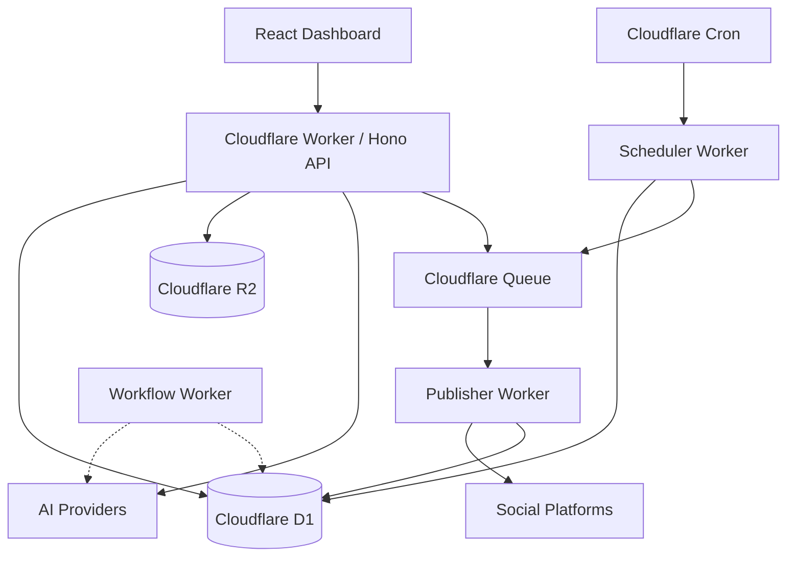

# Social Autopilot

Cloudflare-native AI social media automation platform. AI discovers topics, researches, generates content, validates, schedules, and publishes to social platforms.

**Status:** v0.1 foundation — API, scheduling pipeline, mock publishers, minimal dashboard.

## Architecture



## Technology Stack

| Layer | Technology |
|-------|-----------|
| Frontend | React, TypeScript, Vite, Tailwind CSS |
| API | Cloudflare Workers, Hono |
| Database | Cloudflare D1, Drizzle ORM |
| Storage | Cloudflare R2 |
| Queue | Cloudflare Queues |
| Scheduling | Cloudflare Cron Triggers |
| Workflows | Cloudflare Workflows (stub) |
| AI | OpenAI, Cloudflare Workers AI |
| Validation | Zod |
| Testing | Vitest |
| Monorepo | pnpm, Turborepo |

## Project Structure

```
social-autopilot/
├── apps/
│   ├── api/          # Hono REST API worker
│   └── web/          # React dashboard
├── packages/
│   ├── core/         # Domain + application services
│   ├── ai/           # AI providers, agents, tools
│   ├── social/       # Social publisher abstractions
│   ├── database/     # Drizzle schema, repositories
│   └── config/       # Shared TypeScript configs
├── workers/
│   ├── scheduler/    # Cron → find due posts → enqueue
│   ├── publisher/    # Queue consumer → publish
│   └── workflow/     # Long-running workflows (stub)
├── scripts/          # Seed data, utilities
└── docs/             # Architecture docs
```

## Local Setup

### Prerequisites

- Node.js 20+
- pnpm 9+
- Cloudflare account (for deployment)

### Install

```bash
pnpm install
```

### Database (local D1)

```bash
# Apply migrations locally
cd apps/api
pnpm wrangler d1 migrations apply social-autopilot-db --local

# Seed development data
pnpm wrangler d1 execute social-autopilot-db --local --file=../../scripts/seed.sql
```

### Environment

```bash
cp .env.example .env
```

For OpenAI in local dev, create `apps/api/.dev.vars`:

```
OPENAI_API_KEY=sk-your-key
AI_PROVIDER=openai
```

### Run

```bash
# API worker (port 8787)
pnpm cf:dev

# Web dashboard (port 5173) — in another terminal
pnpm --filter @social-autopilot/web dev
```

## Cloudflare Setup

### 1. Create D1 Database

```bash
wrangler d1 create social-autopilot-db
# Copy database_id into apps/api/wrangler.jsonc and workers/*/wrangler.jsonc
```

### 2. Create R2 Bucket

```bash
wrangler r2 bucket create social-autopilot-media
```

### 3. Create Queues

```bash
wrangler queues create social-autopilot-publish
wrangler queues create social-autopilot-publish-dlq
```

### 4. Apply Migrations (remote)

```bash
cd apps/api
wrangler d1 migrations apply social-autopilot-db --remote
```

### 5. Set Secrets

```bash
wrangler secret put OPENAI_API_KEY --env production
```

### 6. Deploy

```bash
pnpm cf:deploy
# Or deploy individually:
pnpm --filter @social-autopilot/api cf:deploy
pnpm --filter @social-autopilot/scheduler cf:deploy
pnpm --filter @social-autopilot/publisher cf:deploy
```

## AI Provider Configuration

Set `AI_PROVIDER` environment variable:

| Value | Description |
|-------|-------------|
| `workers-ai` | Uses Cloudflare Workers AI binding (default for dev) |
| `openai` | Uses OpenAI API (requires `OPENAI_API_KEY` secret) |

## API Endpoints

| Method | Path | Description |
|--------|------|-------------|
| GET | `/health` | Health check |
| GET | `/api/content` | List content |
| POST | `/api/content` | Create draft |
| GET | `/api/content/:id` | Get content |
| PATCH | `/api/content/:id` | Update content |
| DELETE | `/api/content/:id` | Delete content |
| GET | `/api/scheduled-posts` | List scheduled posts |
| POST | `/api/scheduled-posts` | Schedule a post |
| POST | `/api/scheduled-posts/:id/cancel` | Cancel scheduled post |
| GET | `/api/social-accounts` | List social accounts |

## Development Commands

```bash
pnpm dev          # Start all dev servers (turbo)
pnpm build        # Build all packages
pnpm test         # Run all tests
pnpm lint         # Typecheck all packages
pnpm typecheck    # Typecheck all packages
pnpm db:generate  # Generate Drizzle migrations
pnpm db:migrate   # Apply Drizzle migrations
pnpm cf:dev       # Start API worker locally
pnpm cf:deploy    # Deploy all workers
```

## Testing

```bash
pnpm test
```

Tests cover:
- Content creation and status transitions
- Scheduling validation
- Publisher idempotency
- Scheduler due-post filtering
- Mock AI and social providers

## Deployment

Deploy order:
1. Create Cloudflare resources (D1, R2, Queues)
2. Update `database_id` placeholders in wrangler configs
3. Apply migrations
4. Deploy workers: API → Scheduler → Publisher → Workflow

## Roadmap

### Phase 2
- LinkedIn, X, Facebook/Instagram OAuth
- Real publishing APIs
- Media upload to R2
- Content calendar UI

### Phase 3
- AI content generation pipeline
- Topic research, content scoring
- Image generation, brand voice

### Phase 4
- Autonomous AI agent with tool loop
- MCP server integration
- Analytics and optimization

### Phase 5
- Multi-user, teams, roles
- Billing

## License

MIT
