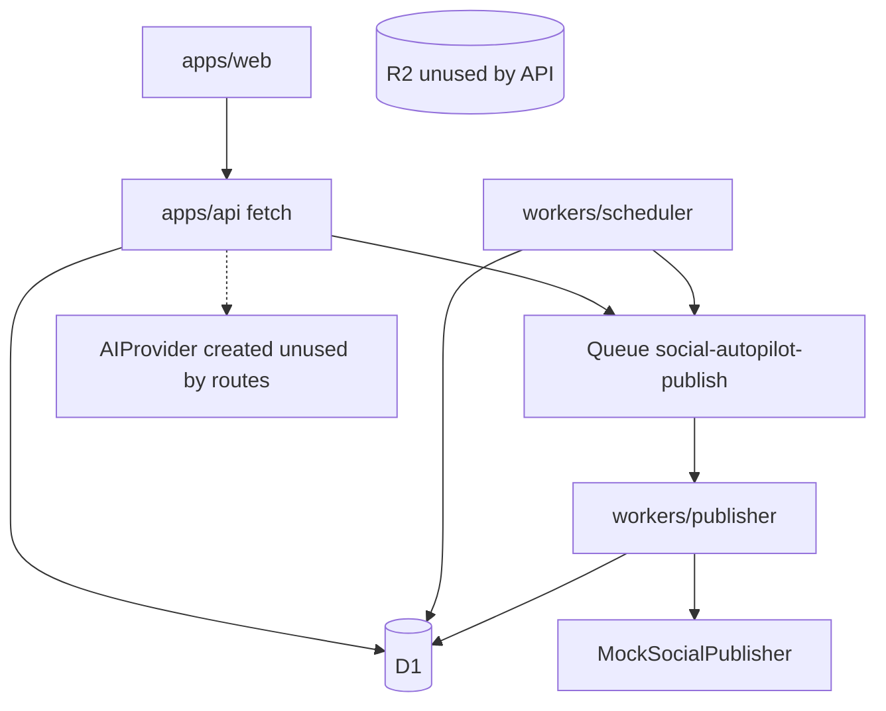
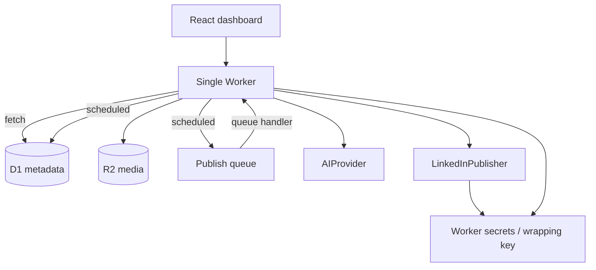
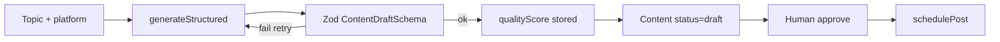

# Implementation Plan

Status: review of the repository as it exists on `main` (`2682485`). This plan is based on source, not the README.

---

## 1. Executive summary

The repo is a usable **foundation**, not an MVP. Domain types, Drizzle schema, a Hono API, mock publishers, and unit tests exist. The end-to-end product path is not wired:

> create → AI generate → approve → schedule → Cron → Queue → Publisher → real platform → published

The most important findings:

1. **Content status is overloaded onto ScheduledPost.** One Content can have many ScheduledPosts, but publishing marks the Content `published` as soon as the first post succeeds. That is incorrect.
2. **Generic `PATCH /api/content/:id` can change `status`.** Domain transition rules block `draft → published`, but they still allow clients and AI tools to drive lifecycle through a generic update. That must become explicit commands.
3. **There is no user boundary.** `DEFAULT_USER_ID` is hardcoded in routes. `getById` / `update` / `delete` / `list` scheduled posts are not scoped to a user.
4. **Three deployable Workers plus a stub Workflow Worker is more surface than the product needs.** One Worker with `fetch` + `scheduled` + `queue` is the Cloudflare-native modular monolith.
5. **Publishing lock has no lease.** A crash after `status = 'publishing'` leaves the post stuck forever.
6. **AI generation is not exposed on the API.** `ContentAgent` exists and is untested against HTTP.
7. **Social publishers are mocks.** Token refs in D1 are placeholders (`token-ref-linkedin`), not a vault.

Do not add platforms, OAuth for all networks, autonomous agents, MCP, or analytics until one real publish path works.

**Recommended next sequence:** Phase 0 hardening → Phase 1 LinkedIn publish → Phase 2 deterministic AI pipeline. Everything else waits.

---

## 2. Current architecture

### 2.1 What actually exists

```
apps/web          React + Vite dashboard (list/create content, list posts/accounts)
apps/api          Hono Worker: HTTP only, queue producer
workers/scheduler Cron every 5 minutes → enqueue { scheduledPostId }
workers/publisher Queue consumer → PublishingService → MockSocialPublisher
workers/workflow  Stub ContentGenerationWorkflow (not called by API)
packages/core     Domain + application services + errors + logger
packages/ai       OpenAIProvider, WorkersAIProvider, ContentAgent, tool factories
packages/social   MockSocialPublisher + adapter to core's SocialPublisher
packages/database Schema, repos, R2 adapter, queue adapter, service container
packages/config   Shared tsconfig
```

### 2.2 Runtime as deployed today



Verified:

- `apps/api/src/lib/context.ts` constructs `aiProvider` but no route uses it.
- `R2MediaStorage` exists; no media routes.
- Social account list bypasses the repository and runs raw SQL.
- Scheduler and publisher each reconstruct the full service container, including mock publishers the scheduler does not need.

### 2.3 Dependency direction (actual)

```
web  →  HTTP API
api  →  core, database, ai, social
scheduler / publisher → core, database, social
database → core  (+ Cloudflare D1/R2/Queue types)
ai → core
social → core
core → (no workspace deps)
```

Direction is mostly correct. Problems:

- `SocialPublisher` is defined twice (`packages/core` and `packages/social`) and glued with `adaptSocialPublishers`.
- `packages/database` is the composition root (`createServices`). Persistence, R2, Queues, and wiring live in one package.
- Tools in `packages/ai` call `ContentService.update(..., { status })` and accept `userId` from the model.

---

## 3. What is already good

Keep these.

| Decision | Why it is good |
|---|---|
| Domain in `packages/core`, Cloudflare adapters outside | Testable without Wrangler |
| `AIProvider` with `generateText` / `generateStructured` | Domain is not coupled to OpenAI SDK |
| Queue payload `{ scheduledPostId }` only | Consumer reloads D1; avoids stale job bodies |
| Optimistic lock `UPDATE ... WHERE status IN ('scheduled','failed')` | Right primitive for D1; no Redis |
| Token columns as refs, not raw tokens in logs | Correct direction for later secrets |
| Zod on HTTP bodies | Right validation layer |
| Typed `AppError` hierarchy | API can map codes to HTTP |
| Structured logger with key redaction | Safe default |
| Mock publishers clearly labeled | Not fake-production |
| Indexes on `(status, scheduled_at)`, `(user_id, status)`, `(user_id, platform)` | Match real queries |
| Vitest unit tests for transitions, scheduling, publish skip | Right layer for now |
| pnpm workspace + Turbo | Fine; do not add more tooling |

---

## 4. Problems found

Verified in source.

### 4.1 Domain / lifecycle

**P0 — Content status duplicates ScheduledPost status.**  
`CONTENT_STATUSES` includes `scheduled | publishing | published | failed`. `PublishingService` then does:

```ts
await this.contentRepository.update(content.id, { status: 'published' });
```

If Content #1 has LinkedIn + X ScheduledPosts, the first successful publish marks the Content published while the other post may still be scheduled.

**P0 — Generic status mutation.**  
`PATCH /api/content/:id` accepts `status: z.enum(CONTENT_STATUSES)`. `ContentService.update` allows any transition in `CONTENT_TRANSITIONS`. That blocks `draft → published`, but allows `draft → approved` and `approved → scheduled` without going through `approveContent` / `schedulePost`. The AI `update_content` tool passes status through the same path.

**P0 — Scheduling skips approval.**  
`ScheduledPostService.create` allows `draft` *or* `approved`. Human approval is not a gate.

**P0 — No user authorization on mutations.**  
`ContentService.getById` / `update` / `delete` do not check `userId`. `ScheduledPostService.list` is `findAll()` across all users. `GET /api/content/:id` returns any id.

**P1 — `validatePublishable` is dead code.**  
Defined on `ScheduledPostService`, never called by `PublishingService`. Max-retry is only applied in the scheduler skip path, not at publish time after a lock.

**P1 — Cancel does not restore Content.**  
Cancelling a ScheduledPost leaves Content in `scheduled`.

**P1 — Content `cancelled` is terminal, ScheduledPost is independent.**  
You can still have scheduled rows for cancelled content if they were created earlier; create path blocks new ones only.

### 4.2 Publishing / scheduler safety

**P0 — No lock lease.**  
`acquirePublishingLock` sets `publishing` with no `publishingStartedAt`. Worker timeout or isolate eviction → row stuck. Cron `findDue` only selects `scheduled` and `failed`, so the post is never retried.

**P0 — Ambiguous provider timeout can double-post.**  
If LinkedIn accepts the post and the Worker times out before `markPublished`, status becomes `failed` (or stays `publishing`). Next retry publishes again. There is no `externalPostId` check before calling the provider except when status is already `published`.

**P1 — Cron stampede.**  
`processDuePosts` enqueues every due row every 5 minutes with no `queuedAt` / claim. Duplicate messages are *mostly* handled by the lock, but they waste Queue retries and can race with `failed` retries.

**P1 — Publisher `message.retry()` after `markFailed`.**  
Failure increments `retryCount` in D1 *and* Cloudflare Queue retries the message. Two retry counters, uncoordinated. `MAX_PUBLISH_RETRIES = 3` vs queue `max_retries: 3`.

**P2 — Mock publisher IDs use `Date.now()`.**  
Not deterministic; useless as an idempotency example.

### 4.3 API / errors / security

**P0 — Zod failures become HTTP 500.**  
`handleError` only special-cases `AppError`. `schema.parse` throws `ZodError`.

**P0 — CORS `Access-Control-Allow-Origin: *`.**  
Unacceptable once OAuth cookies or bearer tokens exist. Tighten before real publishing from a browser.

**P0 — In-memory rate limiter.**  
`rateLimitMap` is module state. Workers are ephemeral; this does not rate-limit in production. Harmless as a sketch, dangerous if treated as a control.

**P1 — Social accounts route uses raw SQL** and aliases `created_at as createdAt` (D1 returns column names as selected). Inconsistent with repositories; also returns nothing about tokens (good) but skips typing.

**P1 — No authn middleware.** Hardcoded UUID in two files.

### 4.4 Package / Worker shape

**P1 — Four Wrangler projects** duplicate D1 ids, env blocks, and `createServices`. Local `pnpm cf:dev` only starts the API Worker. Cron and Queue consumers do not run unless started separately. README implies a pipeline that local `cf:dev` does not provide.

**P1 — `workers/workflow` is premature.** Not referenced by API. Extra deployable with no caller.

**P1 — Duplicate `SocialPublisher` + adapter.** Extra types, no extra safety.

**P2 — `packages/database/src/container.ts` as composition root.** API, scheduler, and publisher all depend on database to construct core services. Wiring belongs in the Worker entry.

**P2 — `lint` scripts are `tsc --noEmit`.** Same as typecheck. No ESLint.

**P2 — `db:migrate` is `drizzle-kit migrate` with `driver: 'd1-http'` and no account credentials in config.** Real local apply path is `wrangler d1 migrations apply`. Script does not match the documented workflow.

**P2 — Turbo `test` `dependsOn: ["^build"]` but packages use `noEmit`.** Dead edge.

### 4.5 AI

**P1 — Structured output is “please return JSON” + `JSON.parse`.** No provider `response_format` / JSON schema mode. Workers AI models will fail this often.

**P1 — Tools trust model-supplied `userId`.** Autonomous later = IDOR.

**P1 — `publish_post` tool is a stub that returns a string.** Either enqueue through `PublishQueue` or do not expose the tool.

**P2 — Models hardcoded** (`gpt-4o-mini`, `@cf/meta/llama-3.1-8b-instruct`). No model id on the interface.

**P2 — No retries, fallback, or usage persistence.** OpenAI captures usage; Workers AI does not; nothing is stored.

### 4.6 Frontend / DX

**P1 — Dashboard cannot approve, schedule, or cancel.** Only create draft + list. Cannot exercise the pipeline from the UI.

**P1 — No single `pnpm dev` that runs API + web + local queues.** Root `dev` is Turbo persistent across packages; API `dev` is wrangler, web `dev` is Vite. Easy to get wrong.

**P2 — README claims `pnpm lint` lints.** It typechecks.

---

## 5. Critical risks

| Risk | Impact | When it bites |
|---|---|---|
| Duplicate social posts | Account bans, user trust | First real provider + timeout |
| Stuck `publishing` rows | Silent missed posts | First Worker timeout |
| Content-level `published` | Partial multi-platform publish looks complete | Second platform |
| Generic status PATCH / AI tools | Skip approval, illegal transitions | Any client or future agent |
| No user scoping | Cross-user read/write | Second user, or guessing UUIDs |
| Token refs with no encryption | Secrets in D1 backups | First OAuth |
| CORS `*` + future bearer tokens | Token theft | Browser auth |
| Local Cron/Queue not in `cf:dev` | “Works in unit tests, fails locally” | Phase 1 debugging |

---

## 6. Target architecture

Stay a **modular serverless monolith**: one Worker, shared packages, one D1, one Queue, one R2 bucket.



Worker handlers:

| Handler | Job |
|---|---|
| `fetch` | HTTP API |
| `scheduled` | Find due ScheduledPosts, enqueue ids |
| `queue` | Load row, lock, publish, persist |

Keep `workers/scheduler` and `workers/publisher` **only until Phase 0 merge**, then delete those packages. Do not keep a Workflow Worker until the AI pipeline has durable multi-step work that exceeds a single request.

Package target:

```
packages/core       domain + application commands (no Cloudflare types)
packages/ai         providers, prompts, pipeline steps, tools wrapping commands
packages/social     SocialPublisher implementations
packages/database   Drizzle schema, repos, migrations only
apps/api            composition root + HTTP + cron + queue handlers
apps/web            UI
```

Move `R2MediaStorage` and `CloudflarePublishQueue` to `apps/api` (or a tiny `packages/cloudflare` only if a second Worker appears). Do not create that package now.

---

## 7. Domain lifecycle

### 7.1 Split the two aggregates

**Content** is the creative artifact. **ScheduledPost** is a platform-specific publishing job. Publishing state must not live on Content.

**Content status (target):**

```
draft → approved → archived
  │         │
  └─────────┴──→ cancelled
```

Optional later: `needs_revision` after a failed quality gate. Not needed for MVP.

**ScheduledPost status (target):**

```
scheduled → publishing → published
     │           │
     │           └──→ failed → scheduled (retry) | dead
     └──→ cancelled
```

`dead` = retries exhausted or uncertain outcome requiring human review. Do not auto-retry `uncertain`.

### 7.2 Illegal transitions (must be impossible via API and tools)

| From | To | Via |
|---|---|---|
| draft | published | PATCH or tool |
| draft | scheduled (content) | PATCH — scheduling creates ScheduledPost only |
| approved | published | PATCH |
| cancelled | anything | any command except maybe `reopen` later |
| published ScheduledPost | scheduled | retry |

### 7.3 Explicit application commands

Replace `ContentService.update(..., { status })`.

| Command | Aggregate | Gate |
|---|---|---|
| `createContent` | Content | user context |
| `updateContent` | Content | owner; status must be `draft` (or `approved` if you allow copy edits — prefer draft-only edits, require re-approval) |
| `approveContent` | Content | owner; from `draft` |
| `cancelContent` | Content | owner; not if any ScheduledPost is `publishing`/`published` without cancelling those first |
| `schedulePost` | ScheduledPost | content `approved`; account belongs to user; `scheduledAt` in the future |
| `cancelScheduledPost` | ScheduledPost | `scheduled` or `failed` |
| `enqueueDuePosts` | ScheduledPost | cron; no HTTP |
| `startPublishing` | ScheduledPost | internal; CAS lock |
| `markPublished` | ScheduledPost | internal; requires `externalPostId` |
| `markPublishFailed` | ScheduledPost | internal |
| `markPublishUncertain` | ScheduledPost | internal; timeout with unknown outcome |

`PublishingService.publishScheduledPost` should call `startPublishing` / `markPublished` / `markPublishFailed` — not `contentRepository.update({ status: 'published' })`.

Derive Content “is scheduled on any platform” in queries (`EXISTS scheduled_posts`), not as a Content column.

### 7.4 Multi-post example

```
Content #1  status=approved
 ├── ScheduledPost LinkedIn  scheduled → published
 └── ScheduledPost X         scheduled → failed
```

Dashboard shows per-destination status. Content remains `approved`.

---

## 8. AI architecture

### 8.1 Keep `AIProvider`, tighten the contract

```ts
interface AIProvider {
  readonly name: string;
  generateText(input: GenerateTextInput): Promise<GenerateTextResult>;
  generateStructured<T>(input: GenerateStructuredInput<T>): Promise<GenerateStructuredResult<T>>;
}
```

Changes vs today:

- `generateStructured` must use provider-native structured output (OpenAI `json_schema` / `response_format`) when available. `JSON.parse` of chat text is a fallback, not the primary path.
- Input includes `model?: string`. Defaults live in config, not class bodies.
- Result always includes `model` and `usage` (zeros if unknown).
- Do **not** add a generic `toolCall` loop in Phase 2.

### 8.2 Deterministic pipeline first (not an agent)

```
TopicInput → outline? (optional) → generateStructured(ContentDraftSchema) → validate → score → persist draft
```

Single application service, e.g. `ContentGenerationService.generateDraft(user, input)`. Internally calls `AIProvider.generateStructured`. No tool loop. No MCP.

Retries: 1–2 retries on parse/validation failure with the schema error appended. Then `AIProviderError`.

Fallback: optional `AIProvider` chain (`openai` then `workers-ai`) only after the primary path is stable. Not Phase 2 required.

Cost tracking: append a `ai_generations` table (userId, contentId, provider, model, tokens, createdAt). Do not log prompts that contain secrets; store prompt *template id*, not raw API keys.

### 8.3 Tools wrap commands, not tables

See section 16 Phase 4/5. Until then, HTTP and the pipeline call application commands directly. Existing tool factories can stay as thin wrappers but must:

- Take `userId` from `AgentContext`, never from model input.
- Call `approveContent` / `schedulePost`, never `update({ status })`.
- Validate with Zod **before** `execute`.

### 8.4 What not to build yet

- Autonomous planner
- Generic tool-calling agent SDK
- MCP server
- Multi-agent research crew

`ContentAgent` can be renamed conceptually to `ContentGenerationService` and lose “agent” branding until Phase 4.

---

## 9. Social publishing architecture

### 9.1 Interface (single copy, in `packages/social`, referenced by application via a core port)

Keep a port on core:

```ts
interface SocialPublisher {
  readonly platform: SocialPlatform;
  publish(input: PublishPostInput): Promise<PublishPostResult>;
}
```

`PublishPostInput` must include:

- `idempotencyKey` (use `scheduledPostId`)
- `accessToken` resolved by a **TokenService** in the Worker, not passed from HTTP
- content body/title
- optional media URLs

Core must never receive raw tokens from HTTP or logs. The Worker resolves tokens, calls publisher, tokens stay in the handler stack.

Delete `adaptSocialPublishers` by making `packages/social` implement the core port directly.

### 9.2 First real provider: LinkedIn

Implement **LinkedIn only** in Phase 1.

Why LinkedIn first:

- Matches an AI “thought leadership” product better than Instagram.
- OAuth 2.0 + posts API is documented and app-review is tractable.
- X API is paid and rate-limited; Meta requires app review for Facebook/Instagram and has stricter media rules.

Keep `MockSocialPublisher` for tests and for platforms without an implementation (`x`, `facebook`, `instagram`). Factory returns LinkedIn real + mocks for the rest, or refuses to publish unimplemented platforms in production (`SocialPublishError`).

### 9.3 Publisher responsibilities

| Concern | Handling |
|---|---|
| Idempotency | Persist `externalPostId` before ack. If row already has `externalPostId`, ack and skip. Send `scheduledPostId` as provider idempotency key if LinkedIn accepts a client-generated key; otherwise treat timeout as `uncertain`. |
| Retries | Retry only `failed` with transient errors (`429`, `5xx`, network). Do not retry `uncertain`. |
| Rate limits | Map HTTP 429 to `ExternalServiceError` with retry delay; Queue retry handles backoff. |
| Token expiry | Publisher throws `TokenExpiredError`; Worker marks account `expired`, post `failed`, no retry until reauth. |
| Provider errors | Typed `SocialPublishError` with `retryable: boolean`. Do not store full response bodies if they may contain tokens. |

### 9.4 Token resolution

```
ScheduledPost.socialAccountId
  → SocialAccount.accessTokenRef
  → TokenStore.get(ref)
  → access token in memory only
```

Phase 1 TokenStore: **encrypted payload in D1** (`token_blobs` table) wrapped with `TOKEN_WRAP_KEY` Worker secret. Do not put raw OAuth tokens in `social_accounts`. Current `accessTokenRef` / `refreshTokenRef` columns stay as keys into that table.

Do not use KV unless token volume requires it. Do not log refs that include token material.

---

## 10. Scheduling architecture

Keep Cron → Queue → consumer. Fix locking.

```mermaid
sequenceDiagram
    participant Cron
    participant D1
    participant Queue
    participant Worker
    participant LinkedIn

    Cron->>D1: SELECT due WHERE status IN (scheduled, failed) AND retry_count < max
    Cron->>D1: SET queuedAt = now WHERE id IN (...)
    Cron->>Queue: send { scheduledPostId }
    Queue->>Worker: deliver
    Worker->>D1: UPDATE publishing WHERE id AND status IN (scheduled, failed)
    alt 0 rows
        Worker->>Queue: ack
    else lock acquired
        Worker->>D1: if externalPostId exists → ack
        Worker->>LinkedIn: publish(idempotencyKey=id)
        alt success
            Worker->>D1: published + externalPostId
            Worker->>Queue: ack
        alt timeout unknown
            Worker->>D1: uncertain
            Worker->>Queue: ack
        else retryable
            Worker->>D1: failed + retryCount++
            Worker->>Queue: retry
        end
    end
```

Concrete D1 lock (keep current CAS, add lease):

```sql
UPDATE scheduled_posts
SET status = 'publishing',
    publishing_started_at = unixepoch(),
    updated_at = unixepoch()
WHERE id = ?
  AND status IN ('scheduled', 'failed')
  AND (external_post_id IS NULL);
```

Reclaim stuck locks in the same Cron that enqueues:

```sql
-- publishing older than 10 minutes with no external_post_id → failed (retryable)
```

If `external_post_id` is set, always `published`, even if status was left dirty.

Cron overlap: Cloudflare may overlap cron invocations. CAS + `queuedAt` (skip rows queued in the last 4 minutes unless `failed`) prevents a queue flood.

Do not introduce Redis, Bull, or a second database.

---

## 11. Cloudflare architecture

Use only what the path needs.

| Service | Need? | Why | Stores / processes | If it fails |
|---|---|---|---|---|
| **Workers** | Yes | API + cron + queue in one isolate | Request/job execution | Posts delay; no data loss if D1 committed |
| **D1** | Yes | Source of truth for users, content, jobs, encrypted token blobs, generation metadata | Relational state | Publishing stops; do not fail open |
| **Queues** | Yes | Decouple cron from provider I/O; retries | `{ scheduledPostId }` | Cron can retry next window; at-least-once → lock required |
| **Cron Triggers** | Yes | Due-post scan without an external scheduler | None | Posts wait until next successful cron |
| **R2** | Later (Phase 2+ media) | Binary assets | Objects; metadata in D1 | Text-only publish still works |
| **Workers AI** | Optional | Default cheap generate in dev | Prompts/completions ephemeral | Fall back to OpenAI or fail generate |
| **Secrets** | Yes, before OAuth | `OPENAI_API_KEY`, `TOKEN_WRAP_KEY`, LinkedIn client secret | Config, not D1 | Deploy cannot publish |
| **Workflows** | Not now | Only when research+generate+score exceeds request time or must survive isolate death | Durable steps | N/A until Phase 3 |
| **KV** | No | No session store yet; tokens fit in D1 | — | — |
| **Durable Objects** | No | Locking is D1 CAS; do not add coordination primitives yet | — | — |
| **Rate Limiting product** | Phase 1 if public | Replace in-memory map | Edge counters | Abuse of API |

Environments: keep `development` / `staging` / `production` in one `wrangler.jsonc`. Fill real `database_id` values; placeholders will fail remote deploy (already documented).

---

## 12. Security requirements

Required **before** real LinkedIn publishing (Phase 0 + Phase 1).

1. **TokenStore** with envelope encryption. Raw access/refresh tokens never in `social_accounts`, logs, API JSON, or the dashboard.
2. **UserContext** on every command. Even with a bootstrap user, `getById` must compare `content.userId === currentUser.id`.
3. **No status in PATCH.** No `update_content` tool with `status`.
4. **ZodError → 400.** Do not leak Zod internals in production.
5. **CORS allowlist** (`http://localhost:5173` and the Pages origin).
6. **LinkedIn client id/secret** only as Worker secrets.
7. **Publisher never logs Authorization headers.** Extend logger denylist if new keys appear (`bearer`, `client_secret`).
8. **AI tools** (when enabled) ignore model-supplied `userId`.
9. **SSRF** (Phase 3 research): allowlist schemes `https`; block link-local, metadata IPs, and Cloudflare internal ranges; timeout and max body size on `fetchUrl`.
10. **Do not treat in-memory rate limit as production.** Use Cloudflare Rate Limiting or skip until the API is authenticated.
11. **Dashboard must not receive `accessTokenRef` values that are useful.** Current social-accounts SQL already omits token columns — keep it that way.

Out of scope until Phase 5+ auth: real IdP, sessions, CSRF for cookie auth. The UserContext seam must exist first.

### 12.1 UserContext boundary (no auth implementation)

```
HTTP
 → requestId middleware
 → userContext middleware   ← ONLY place that sets current user
 → routes
 → application commands(currentUser, input)
```

`userContext` today: `c.set('user', { id: BOOTSTRAP_USER_ID })` from a single constant or `BOOTSTRAP_USER_ID` var.

Later: replace middleware body with session/JWT verification. **Do not** pass `userId` in JSON bodies for create/list.

Locations to change:

- `apps/api/src/middleware/index.ts` — new middleware
- `apps/api/src/lib/errors.ts` `HonoEnv.Variables` — `user: CurrentUser`
- All routes — `c.get('user')` instead of `DEFAULT_USER_ID`
- `ContentService` / `ScheduledPostService` — `userId` argument on every read/write
- AI `AgentContext.userId` — copied from CurrentUser, not from tool args

---

## 13. Testing strategy

Current tests (26) are in-memory unit tests. Keep them. Add layers as features land.

| Layer | What | How |
|---|---|---|
| Unit domain | Transitions, command guards | Vitest, no I/O |
| Unit application | create/approve/schedule/cancel/publish lock | Fake repos |
| Unit AI | schema validation, tool arg stripping | Mock `AIProvider` |
| Unit social | LinkedIn mapper, error classification | Mock `fetch` |
| Integration D1 | Repositories + lock CAS | `wrangler d1` miniflare / vitest pool workers |
| Integration queue | Cron enqueue + consumer ack | Miniflare queues |
| Contract | `SocialPublisher` mock vs LinkedIn fake server | Shared fixtures |

Never call live OpenAI, Workers AI, or LinkedIn in unit tests.

Priority tests for Phase 0:

- `draft` cannot become `published` via update
- `schedulePost` requires `approved`
- two ScheduledPosts, one publish ≠ content-wide published
- second `publishScheduledPost` with existing `externalPostId` does not call publisher
- lock not acquired → no publish
- reclaim of stale `publishing`
- getById for another user → `NotFoundError` or `AuthorizationError`

---

## 14. Phased implementation plan

### Phase 0 — Architecture hardening

**Objective:** Make the domain and Worker shape safe enough to attach a real publisher.

**Prerequisites:** Current `main`.

**Priority:** P0.

**Files / modules:**

- `packages/core` content + scheduled-post domain and services
- `packages/ai/src/tools/index.ts` (stop status mutation)
- `apps/api` routes, middleware, error mapper
- `apps/api` merge cron + queue handlers; delete or re-export old workers
- `packages/database` schema migration for publishing lease columns; stop overloading content status
- `packages/social` remove adapter; implement core port
- `apps/web` approve + schedule + cancel (minimal)

**New interfaces:** `CurrentUser`, command methods listed in §7.3, `TokenStore` interface (in-memory/fake impl ok until Phase 1).

**Database:**

- Add `scheduled_posts.publishing_started_at`, `queued_at`, `uncertain`/`dead` status or reuse `failed` + `error_code`
- Stop writing publishing statuses onto `contents` (migrate existing rows)

**Cloudflare:** One Worker: `fetch` + `triggers.crons` + `queues.consumers` + `queues.producers`. Remove extra Worker projects.

**API:**

- Remove `status` from PATCH body
- `POST /api/content/:id/approve`
- Keep schedule/cancel
- Map ZodError to 400
- UserContext middleware
- Restrict CORS

**Tests:** command tests, user scoping, lock lease reclaim, Zod error mapping.

**Acceptance:**

- Cannot PATCH a draft to published
- Cannot schedule unapproved content
- `pnpm cf:dev` runs HTTP, cron, and queue locally
- Multi-destination: one published ScheduledPost does not mark Content published
- All existing unit tests updated and green

**Risks:** Migration of in-flight statuses in any existing D1 (likely empty). Frontend must add approve before schedule works.

---

### Phase 1 — Real social publishing (LinkedIn)

**Objective:** Approved content can be scheduled and appear on LinkedIn without duplicates.

**Prerequisites:** Phase 0.

**Priority:** P0 / P1.

**Files:** `packages/social/src/providers/linkedin.ts`, TokenStore impl, OAuth routes (LinkedIn only), publisher error mapping, secrets in wrangler.

**New interfaces:** `LinkedInPublisher`, `TokenStore`, `OAuthStateStore` (D1 or signed cookie).

**Database:** `token_blobs` (encrypted); oauth state nonce table; `social_accounts.external_account_id` from LinkedIn person/org id.

**Cloudflare:** Secrets `LINKEDIN_CLIENT_ID`, `LINKEDIN_CLIENT_SECRET`, `TOKEN_WRAP_KEY`. No new products.

**API:**

- `GET /api/oauth/linkedin/start`
- `GET /api/oauth/linkedin/callback` (or documented Worker route)
- Social accounts list remains token-free
- Optional `POST /api/scheduled-posts/:id/publish-now` enqueues the same queue path (no bypass of lock)

**Tests:** mock LinkedIn HTTP; timeout → `uncertain` and no second create; 401 → account expired; CAS lock.

**Acceptance:**

- Connect one LinkedIn account in staging
- Schedule a post, wait for cron (or publish-now)
- LinkedIn shows one post, `externalPostId` stored
- Kill worker after send (simulated timeout) does not create a second post *or* lands in `uncertain` for human retry, never silent duplicate
- Tokens never returned to `apps/web`

**Risks:** LinkedIn app review, token refresh, personal vs organization author URN. Duplicate posts if uncertain is retried blindly — do not auto-retry uncertain.

**Do not** implement X/Facebook/Instagram.

---

### Phase 2 — AI content generation

**Objective:** User supplies a topic; system produces a validated draft; human approves; then Phase 1 path.

**Prerequisites:** Phase 0 (commands). Phase 1 preferred so generation is not a dead end.

**Priority:** P1.

**Files:** `packages/ai` pipeline service, Zod `ContentDraftSchema`, `apps/api` `POST /api/content/generate`, dashboard generate form. Optionally persist `ai_generations`.

**New interfaces:** `ContentDraftSchema`, `ContentGenerationService`. No agent loop.

**Database:** optional `ai_generations`; Content stays draft until approve.

**Cloudflare:** Workers AI binding already present; `OPENAI_API_KEY` secret. **Do not add Workflows yet** unless generation + validation exceeds CPU time in practice.

**API:** `POST /api/content/generate` `{ topic, tone?, platform? }` → `{ content }`.

**Tests:** mock provider returning invalid JSON; schema reject; valid JSON persisted as draft; userId from context.

**Acceptance:**

- Generate → draft in D1 with title/body/hashtags/qualityScore
- Invalid model output does not persist
- User must approve before schedule

**Risks:** Workers AI JSON reliability; keep OpenAI as the staging default for structured output.

Suggested structured payload:

```ts
{
  title: z.string().min(1),
  body: z.string().min(1),
  hashtags: z.array(z.string()).default([]),
  platform: z.enum(['linkedin', 'x', 'facebook', 'instagram']),
  suggestedPublishAt: z.string().datetime().optional(),
  qualityScore: z.number().min(0).max(1),
}
```

Human approval remains mandatory. Score is informational until Phase 6.

---

### Phase 3 — Research agent (interfaces first, then one tool)

**Objective:** Traceable sources behind a draft. Not autonomous browsing.

**Prerequisites:** Phase 2.

**Priority:** P2.

**New interfaces (define before implementation):**

```ts
interface ResearchTool<TIn, TOut> { name; description; inputSchema; execute }
// searchWeb, fetchUrl, extractArticle, summarizeSource, saveSource, findTrendingTopics
```

`ResearchService.researchTopic(user, topic) → { sources: Source[] }`  
`Source { id, url, title, excerpt, retrievedAt, contentId? }`

**Database:** `sources` table. Content references `source_ids`.

**Cloudflare:** outbound `fetch` only. No Browser Rendering unless extract fails in practice.

**API:** `POST /api/research/topics` later; MVP of this phase can be internal to generate.

**Tests:** SSRF blocklist; schema; sources persisted.

**Acceptance:** A generated draft can list source URLs. Fetch of `http://127.0.0.1` is rejected.

**Risks:** SSRF, copyrighted full-text storage (store excerpt + URL, not full scrape by default).

Use Workflows **here** if research is multi-step and long: `research → summarize → generate`. Not before.

---

### Phase 4 — Autonomous content agent

**Objective:** A constrained loop that may call **allowlisted** tools, still requiring human approval before publish.

**Prerequisites:** Phase 2–3, UserContext, explicit commands.

**Priority:** P2.

Allowlist only. Max N steps. No `update_content` with arbitrary status. `schedule_post` and `publish_post` require `approvalMode: human` until a future flag.

**Acceptance:** Agent can create a draft from a topic using research tools; cannot publish without `approveContent`.

**Risks:** Prompt injection via fetched pages. Treat fetched text as untrusted data, not instructions.

---

### Phase 5 — MCP interface

**Objective:** Expose the same allowlisted tools over MCP for Cursor/Claude.

**Prerequisites:** Phase 4 tools with authz.

**Priority:** P3.

Same commands, same UserContext (API token per user). Do not invent a second domain API.

---

### Phase 6 — Analytics and optimization

**Objective:** Store provider metrics; later adjust suggestedPublishAt / scoring.

**Prerequisites:** Phase 1 `externalPostId`.

**Priority:** P2/P3.

`post_metrics` table; poll LinkedIn analytics on a slow cron. Learning loop is last.

Do not build this before a post has gone live.

---

## 15. Priority matrix

Focus list for “working product”:

| ID | Task | Pri |
|---|---|---|
| Split Content vs ScheduledPost statuses | P0 |
| Explicit commands; remove status from PATCH and tools | P0 |
| UserContext + owner checks | P0 |
| ZodError → 400; CORS allowlist | P0 |
| Publishing lease + reclaim; `externalPostId` short-circuit | P0 |
| Uncertain outcome state; no blind retry | P0 |
| Merge into one Worker (fetch/cron/queue) | P0 |
| TokenStore encryption | P0 |
| LinkedIn OAuth + LinkedInPublisher | P0 |
| Dashboard: approve, schedule, cancel, see per-post status | P1 |
| `POST /api/content/generate` structured pipeline | P1 |
| Queue `queuedAt` to reduce stampede | P1 |
| `ai_generations` usage rows | P2 |
| Research sources + SSRF-safe fetch | P2 |
| Workflows for long research | P2 |
| X / Meta publishers | P2 |
| Autonomous loop | P2 |
| MCP | P3 |
| Analytics | P3 |
| Teams / billing | P3 |
| ESLint, extra packages, KV, Durable Objects | P3 / skip |

---

## 16. ADR recommendations

Write these under `docs/adr/` when Phase 0 starts. Do not write them as code.

### ADR-001: Cloudflare-native architecture

Workers + D1 + Queue + Cron (+ R2 later). No Postgres, Redis, or ECS.

### ADR-002: Modular monolith instead of microservices

One Worker, several packages. Extra Workers only for a concrete isolation reason (none today).

### ADR-003: AI provider abstraction

Application calls `AIProvider`. Structured output is schema-first. No OpenAI types in `packages/core`.

### ADR-004: Social publisher abstraction

One port, per-platform adapters. Production may ship one real adapter.

### ADR-005: ScheduledPost idempotency

D1 CAS lock + `externalPostId` + lease reclaim + Queue payload is id-only. Timeouts with unknown provider result → `uncertain`, not retry.

### ADR-006: AI tool authorization model

Tools call application commands. `userId` from `CurrentUser`. Model cannot set status or act as another user.

### ADR-007: Human approval boundary

`schedulePost` requires `Content.status === 'approved'`. Agents may create drafts only until a later explicit policy says otherwise.

---

## 17. Definition of Done for MVP

MVP is **not** “all phases”. MVP is:

1. Bootstrap user (UserContext, not scattered constants)
2. Create or AI-generate a **draft**
3. Human **approves**
4. Human **schedules** to a connected LinkedIn account
5. Cron enqueues; Queue consumer publishes **once**
6. D1 stores `externalPostId` and per-destination status
7. Dashboard shows draft / approved / scheduled / published / failed / uncertain
8. Tokens never reach the browser
9. Unit tests for commands + lock; mocked LinkedIn tests
10. `pnpm test`, `pnpm typecheck`, `pnpm cf:dev` exercise the path locally with Miniflare Queue/Cron

If any of 3–6 are missing, it is not an MVP.

---

## 18. Explicitly out of scope

Until MVP exists, do **not**:

- Implement X, Facebook, or Instagram publishing
- Multi-user IdP, teams, roles, billing
- Autonomous publish without approval
- MCP server
- Analytics / engagement learning
- Image/video generation
- Browser rendering / full research crawler
- Redis, Postgres, SQS, Temporal, extra “agent frameworks”
- Durable Objects for locks
- A second microservice
- Expanding Workflows as a default for every job
- Trust README as the spec (this document supersedes it where they conflict)

---

## Appendix A — Content AI pipeline (Phase 2 design)



No free-form parse. Retry once on Zod failure. Persist only after parse success.

---

## Appendix B — Tool catalog (when tools exist)

| Tool | Purpose | Input | Output | Authz | Service | Autonomous? | Human approval? |
|---|---|---|---|---|---|---|---|
| `create_content` | Create draft | title, body, contentType? | id, status | CurrentUser | `createContent` | Yes | No (draft only) |
| `update_content` | Edit draft copy | id, title?, body? | id, status | owner | `updateContent` | Yes if draft | Re-approval if already approved |
| `approve_content` | Approval gate | id | id, status | owner | `approveContent` | **No** | This *is* approval |
| `get_content` | Read | id | content DTO | owner | `getContent` | Yes | No |
| `list_social_accounts` | List destinations | (none) | accounts | CurrentUser | `listSocialAccounts` | Yes | No |
| `schedule_post` | Create ScheduledPost | contentId, socialAccountId, scheduledAt | post id | owner + approved | `schedulePost` | **No** until policy | Yes |
| `cancel_scheduled_post` | Cancel job | id | post id | owner | `cancelScheduledPost` | No | N/A |
| `publish_post` | Enqueue existing job | scheduledPostId | queued | owner | queue.send | **No** | Must already be approved+scheduled |
| `search_topics` | Research | query | topic list | CurrentUser | ResearchService | Yes | No |
| `save_source` | Persist citation | url, excerpt | source id | CurrentUser | ResearchService | Yes | No |

`userId` never appears in tool input schemas.

---

## Appendix C — Media (future, after text MVP)

- D1 `media` already has `bucket`, `key`, `mimeType`, `size`. Keep metadata in D1.
- Bytes in R2 via `MediaStorage`.
- Add `purpose` (`original | generated | thumbnail`) and `platformConstraints` JSON later.
- LinkedIn image upload is a Phase 1 follow-up, not a blocker for text posts.

---

## Appendix D — Developer workflow (target)

```bash
pnpm install
pnpm db:local          # wrangler d1 migrations apply --local && seed
pnpm dev               # Vite :5173 + wrangler dev :8787 with cron+queue
pnpm test
pnpm typecheck
```

Replace `db:migrate` with Wrangler D1 apply. Document `.dev.vars` for secrets. One `wrangler.jsonc` in `apps/api`.
