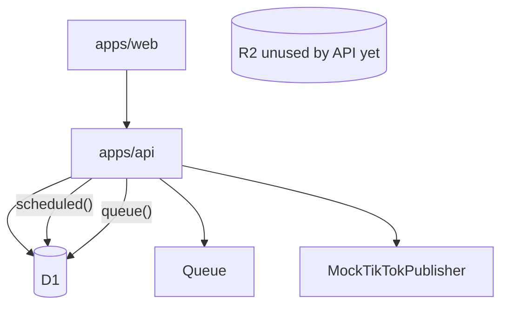

# Implementation Plan — TikTok-first

This document supersedes the LinkedIn-first review. It reflects the repository **after** the TikTok-first direction update.

---

## 1. Executive summary

The product is an **AI-powered TikTok content automation platform** on Cloudflare.

MVP path:

```text
create / AI generate → approve → upload video (R2) → connect TikTok
  → schedule → Cron → Queue → Publisher → TikTok → persist result
```

TikTok is the only destination. Extensibility remains via one `SocialPublisher` port — not a multi-platform product.

**Next implementation step: Phase 1A TikTok OAuth.** Do not start OAuth in the same change as this direction update.

---

## 2. Current architecture



**Runtime:** `apps/api` handles `fetch` + `scheduled` + `queue`.

---

## 3. What is already good

- Domain vs Cloudflare adapters
- Queue payload `{ scheduledPostId }`
- D1 CAS publishing lock + lease columns
- Token refs, not raw tokens in API responses
- `AIProvider` (Workers AI / OpenAI)
- Typed errors, structured logs
- Bootstrap `UserContext` in middleware
- Explicit content commands (`create` / `update` / `approve` / `cancel`)
- Approval required before schedule
- Publish does not mutate Content status

---

## 4. Problems found (remaining)

- `TokenStore` is an interface only — no encryption yet (Phase 1A)
- In-memory rate limiter is not a production control
- AI generate is not an HTTP route yet (Phase 2)
- R2 upload API not wired (Phase 1B)

---

## 5. Critical risks (TikTok)

| Risk | Mitigation |
|------|------------|
| Duplicate TikTok posts | `externalPostId` short-circuit; `uncertain` never auto-retried |
| Stuck `publishing` | `publishingStartedAt` lease reclaim |
| Token leak | Worker-only TokenStore; omit token fields from API |
| Skip approval | `schedulePost` requires `approved` |
| Cross-user access | `UserContext`; get-or-404 if not owner |

---

## 6. Target architecture

One Worker, D1, R2, one Queue, Cron, Secrets, optional Workers AI / OpenAI.

```text
packages/core       commands + domain
packages/ai         TikTok draft schema + providers
packages/social     SocialPublisher port + MockTikTokPublisher; later tiktok/*
packages/database   Drizzle only
apps/api            composition root + fetch/scheduled/queue
apps/web            dashboard
```

---

## 7. Domain lifecycle

**Content:** `draft → approved → archived | cancelled`  
**ScheduledPost:** `scheduled → publishing → published`; `failed` (retry); `uncertain` (stop); `dead` (permanent).

One Content may have many ScheduledPosts later. Publishing state stays on the job.

Commands: `createContent`, `updateContent` (draft copy only), `approveContent`, `cancelContent`, `schedulePost`, `cancelScheduledPost`, `enqueueDuePosts`, `startPublishing` (lock), `markPublished`, `markPublishFailed`, `markPublishUncertain`.

No `PATCH` with `{ status: "published" }`.

---

## 8. AI architecture

Keep `AIProvider`. First pipeline (Phase 2):

```text
Topic → generateStructured(TikTokContentDraft) → Zod → draft Content
```

Schema: `hook`, `script`, `caption`, `hashtags`, `cta`, `suggestedPublishAt`, `qualityScore`.

No agents, MCP, research, or video generation until later phases.

Tools wrap commands and take `UserContext` from the host — never `userId` from the model.

---

## 9. Social publishing architecture

One port in `packages/core`:

```ts
interface SocialPublisher {
  platform: 'tiktok';
  publish(input: PublishPostInput): Promise<PublishPostResult>;
}
```

`PublishPostInput` includes `idempotencyKey` (`scheduledPostId`).

Future files (not implemented):

```text
packages/social/src/tiktok/
  TikTokClient.ts
  TikTokOAuth.ts
  TikTokPublisher.ts
  TikTokErrors.ts
```

Today: `MockTikTokPublisher` only.

---

## 10. Scheduling architecture

```text
Cron → reclaim stale publishing → find due → claim queuedAt → Queue
  → lock → if externalPostId skip → TikTok → markPublished | failed | uncertain
```

---

## 11. Cloudflare architecture

| Service | Why | Failure |
|---------|-----|---------|
| Workers | Execute API/jobs | Delay |
| D1 | Source of truth | Stop publish |
| Queues | At-least-once jobs | Lock required |
| Cron | Due scan | Wait next tick |
| R2 | Videos | Text-only cannot ship to TikTok |
| Secrets | OAuth + wrap key | Cannot connect |
| Workers AI / OpenAI | Drafts | Generate fails |

Skip: KV, Durable Objects, Workflows (until Phase 3 long video), extra Workers.

---

## 12. Security requirements

Before live TikTok (Phase 1): encrypted TokenStore, CORS allowlist (now `CORS_ORIGIN`), no tokens in JSON, no model-supplied userId, Zod → 400, uncertain not retried.

SSRF rules apply only when research fetch exists (Phase 4).

---

## 13. Testing strategy

Unit: domain, commands, owner checks, publisher outcomes.  
Mock TikTok only. No live TikTok or AI.

---

## 14. Phased implementation plan

### Phase 0 — Architecture hardening

Lifecycle split, commands, UserContext, lease, idempotency, uncertain, Zod 400, CORS allowlist, one Worker (`fetch` + `scheduled` + `queue`), tests. **Complete.**

### Phase 1 — TikTok MVP

**1A OAuth** — start/callback, account row, TokenStore encrypt, refresh server-side.  
**1B Video** — R2 upload, D1 metadata (`key`, mime, size, duration), ownership.  
**1C Publisher** — TikTok client, error mapping, retry vs uncertain vs dead.  
**1D Scheduling** — dashboard approve → schedule → cron → queue → publisher.  
**1E E2E** — create → approve → upload → connect → schedule → persist `externalPostId`.

### Phase 2 — TikTok AI

Topic → script/caption/hashtags/score → human approval.

### Phase 3 — AI video pipeline

```text
Topic → script → voice → visuals → composition → R2 → TikTok
```

TTS, clips, subtitles, hook optimization — not MVP.

### Phase 4 — Research

### Phase 5 — Autonomous agent (still cannot publish without approval)

### Phase 6 — MCP

### Phase 7 — Analytics / optimization

---

## 15. Priority matrix

| Task | Pri |
|------|-----|
| TikTok OAuth + TokenStore | P0 |
| R2 video upload | P0 |
| TikTokPublisher + uncertain handling | P0 |
| Schedule E2E | P1 |
| AI TikTok draft HTTP | P1 |
| Other platforms | out |
| MCP / agents / analytics | P3 |

---

## 16. ADR recommendations

- ADR-001 Cloudflare-native
- ADR-002 Modular monolith, one Worker
- ADR-003 AIProvider
- ADR-004 SocialPublisher (TikTok first)
- ADR-005 ScheduledPost idempotency + uncertain
- ADR-006 Tools use UserContext
- ADR-007 Human approval before schedule
- ADR-008 Video in R2, metadata in D1

---

## 17. Definition of Done for MVP

Bootstrap UserContext; create/generate TikTok draft; approve; R2 video; connect TikTok; schedule; cron; queue; publish once; `externalPostId`; per-job status; safe retries; uncertain; dashboard; tokens never in browser; unit + mocked TikTok tests; local path.

---

## 18. Out of scope

LinkedIn, X, Meta, Instagram, IdP, teams, billing, autonomous publish, MCP, analytics, AI video (until Phase 3), Redis, Postgres, Temporal, Durable Objects, Kubernetes, extra microservices.
