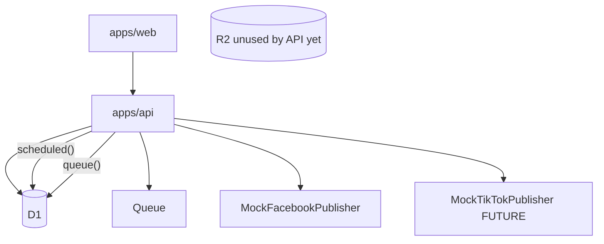

# Implementation Plan — Affiliate-first

This document supersedes the TikTok-first plan. It reflects the repository **after** the AI Affiliate Content Autopilot direction update.

Historical note: the repo was previously LinkedIn-first, then TikTok-first. TikTok is retained as a **PENDING / FUTURE** distribution channel, not deleted.

---

## 1. Executive summary

The product is an **AI Affiliate Content Autopilot** on Cloudflare.

Core flow:

```text
Affiliate → Content → Media → Distribution → Analytics
```

Not:

```text
TikTok → Content
```

MVP path:

```text
Shopee product → AffiliateOffer → AI content → approval → media (later)
  → schedule → Cron → Queue → Publisher → Facebook → persist result
```

- **Shopee** is the first affiliate provider.
- **Facebook** is the first distribution target.
- **TikTok** is a future `SocialPublisher` adapter.

Extensibility remains via ports (`AffiliateProvider`, `SocialPublisher`, `AIProvider`) — not a multi-platform product yet.

**Next implementation step: Phase 1 — verify current Shopee Affiliate/API capabilities.** Do not implement Shopee, Facebook, or TikTok HTTP/OAuth in the same change as this direction update.

---

## 2. Current architecture



**Runtime:** `apps/api` handles `fetch` + `scheduled` + `queue`.

Product and AffiliateOffer exist as domain types. Persistence and provider HTTP are Phase 1.

---

## 3. What is already good

- Domain vs Cloudflare adapters
- Queue payload `{ scheduledPostId }`
- D1 CAS publishing lock + lease columns
- Token refs, not raw tokens in API responses
- `AIProvider` (Workers AI / OpenAI)
- Typed errors, structured logs
- Bootstrap `UserContext` in middleware
- Explicit content commands (`create` / `update` / `approve` / `cancel`)
- Approval required before schedule
- Publish does not mutate Content status
- `SocialPublisher` port (now channel-agnostic)
- Idempotent / failed / uncertain / dead publishing states

Reuse this foundation. Do not redesign scheduling, locks, or queues without a concrete reason.

---

## 4. Problems found (remaining)

- No Product / AffiliateOffer persistence yet (Phase 1)
- `TokenStore` is an interface only — no encryption yet (Phase 4 Facebook OAuth)
- In-memory rate limiter is not a production control
- AI generate is not an HTTP route yet (Phase 2)
- R2 upload API not wired (Phase 3)
- Content persisted shape is still `title` / `body`; structured affiliate copy is conceptual until Phase 2

---

## 5. Critical risks

| Risk | Mitigation |
|------|------------|
| Duplicate distribution posts | `externalPostId` short-circuit; `uncertain` never auto-retried |
| Stuck `publishing` | `publishingStartedAt` lease reclaim |
| Token leak | Worker-only TokenStore; omit token fields from API |
| Skip approval | `schedulePost` requires `approved` |
| Cross-user access | `UserContext`; get-or-404 if not owner |
| Assumed Shopee/Facebook APIs | Verify capabilities, auth, quotas, and policies before coding clients |
| Product URL vs affiliate URL | Keep `Product.productUrl` separate from `AffiliateOffer.affiliateUrl` |
| TikTok leaking into core | Platform details stay in adapters; Content stays channel-neutral |

---

## 6. Target architecture

One Worker, D1, R2, one Queue, Cron, Secrets, optional Workers AI / OpenAI.

```text
packages/core       commands + domain (Product, AffiliateOffer, Content, MediaAsset, Distribution)
packages/ai         affiliate draft schema + providers
packages/social     SocialPublisher port + mock adapters; later facebook/* and tiktok/*
packages/database   Drizzle only
apps/api            composition root + fetch/scheduled/queue
apps/web            dashboard
```

Future affiliate adapters (not a package yet): Shopee first, behind an `AffiliateProvider` port.

```text
                    Dashboard
                        │
                        ▼
                Cloudflare Worker
                     Hono
                        │
        ┌───────────────┼────────────────┐
        ▼               ▼                ▼
       D1               R2               AI
        │               │                │
        ▼               ▼                ▼
    Products        Media Assets    Workers AI /
    Affiliate                         OpenAI
    Content
    Posts
        │
        ▼
      Queue
        │
   ┌────┴─────┐
   ▼          ▼
Facebook    TikTok
(first)     (FUTURE)
```

---

## 7. Domain lifecycle

See [domain.md](./domain.md) for conceptual fields.

**Product / AffiliateOffer:** imported from a provider; not persisted in this phase.

**Content:** `draft → approved → archived | cancelled`  
Platform-independent copy (`hook`, `script`, `caption`, `CTA`, `hashtags`, `language`, `tone`). Publishing state stays on the job.

**MediaAsset:** attached later; R2 binaries, D1 metadata.

**ScheduledPost:** `scheduled → publishing → published`; `failed` (retry); `uncertain` (stop); `dead` (permanent).

One Content may have many ScheduledPosts later. One Product may have many Content drafts.

Commands (existing, keep): `createContent`, `updateContent` (draft copy only), `approveContent`, `cancelContent`, `schedulePost`, `cancelScheduledPost`, `enqueueDuePosts`, `startPublishing` (lock), `markPublished`, `markPublishFailed`, `markPublishUncertain`.

Future commands (do not implement now): `importProduct`, `createAffiliateOffer`, `attachMediaAsset`.

No `PATCH` with `{ status: "published" }`.

---

## 8. AI architecture

Keep `AIProvider`. First affiliate pipeline (Phase 2):

```text
Product + AffiliateOffer → generateStructured(AffiliateContentDraft) → Zod → draft Content
```

Schema (platform-neutral): `hook`, `script`, `caption`, `cta`, `hashtags`, `videoScenePlan`, `qualityScore`, plus optional `language` / `tone`.

Do **not** put Facebook-specific or TikTok-specific fields in the core draft schema.

No autonomous agents, MCP, or video generation until later phases.

Tools wrap commands and take `UserContext` from the host — never `userId` from the model.

---

## 9. Social publishing / distribution architecture

One port in `packages/core`:

```ts
interface SocialPublisher {
  platform: SocialPlatform; // 'facebook' | 'tiktok'
  publish(input: PublishPostInput): Promise<PublishPostResult>;
}
```

`PublishPostInput` includes `idempotencyKey` (`scheduledPostId`). Affiliate URL stays separate from the media asset.

```text
Distribution
├── Facebook       ← first target
├── TikTok         ← PENDING / FUTURE
├── Instagram      ← future
└── YouTube        ← future
```

Future files (not implemented):

```text
packages/social/src/facebook/
  FacebookClient.ts
  FacebookOAuth.ts
  FacebookPublisher.ts
  FacebookErrors.ts

packages/social/src/tiktok/
  TikTokClient.ts
  TikTokOAuth.ts
  TikTokPublisher.ts
  TikTokErrors.ts
```

Today: `MockFacebookPublisher` (first target) and `MockTikTokPublisher` (future adapter). Neither calls a live API.

---

## 10. Scheduling architecture

Reuse the existing design:

```text
Cron → reclaim stale publishing → find due → claim queuedAt → Queue
  → lock → if externalPostId skip → Publisher → markPublished | failed | uncertain
```

Preserve: idempotency, publishing locks, lease recovery, failed / uncertain / dead, retry rules.

Do not redesign these mechanisms without a concrete reason.

---

## 11. Cloudflare architecture

| Service | Why | Failure |
|---------|-----|---------|
| Workers | Execute API/jobs | Delay |
| D1 | Source of truth | Stop publish |
| Queues | At-least-once jobs | Lock required |
| Cron | Due scan | Wait next tick |
| R2 | Media assets | Text-only distribution is limited |
| Secrets | OAuth + wrap key + later affiliate creds | Cannot connect |
| Workers AI / OpenAI | Drafts | Generate fails |

Skip: KV, Durable Objects, Workflows (until Phase 3 long video), extra Workers.

---

## 12. Security requirements

Before live Facebook (Phase 4): encrypted TokenStore, CORS allowlist (now `CORS_ORIGIN`), no tokens in JSON, no model-supplied userId, Zod → 400, uncertain not retried.

Before live Shopee (Phase 1): treat affiliate credentials as Worker secrets; never return them from the API.

SSRF rules apply only when research fetch exists (later).

Affiliate-link policies (Meta, Shopee, TikTok) must be verified before publishing affiliate URLs.

---

## 13. Testing strategy

Unit: domain, commands, owner checks, publisher outcomes.  
Mock publishers only. No live Shopee, Facebook, TikTok, or AI.

---

## 14. Phased implementation plan

### Phase 0 — Architecture & domain refactor

Move the repository from TikTok-first to Affiliate-first **without** external integrations.

- Update README, implementation plan, architecture docs
- Generalize Content domain (platform-independent)
- Generalize SocialPublisher / Distribution
- Introduce Product, AffiliateOffer, MediaAsset concepts
- Identify TikTok-specific assumptions; keep TikTok behind adapters as future work
- Review tests and terminology
- Preserve current behavior unless a domain-boundary change is required

**This phase. Do not over-engineer persistence or providers yet.**

### Phase 1 — Shopee Affiliate foundation

Establish the first affiliate provider.

Planned:

- Shopee provider abstraction
- Product discovery/import
- Product normalization
- Affiliate offer abstraction
- Affiliate URL generation
- Product + AffiliateOffer persistence
- Provider-specific error handling
- Configuration/secrets design

**Before implementing the real integration:** verify current Shopee Affiliate/API capabilities, authentication, link generation, quotas, and policy constraints. Do not assume an API exists or works in a particular way.

### Phase 2 — AI Affiliate Content

```text
Product → AffiliateOffer → AI → Content
```

Structured, schema-validated output. Human approval remains required. Do **not** implement autonomous agents.

### Phase 3 — Media / video pipeline

```text
Product Images + AI Script + TTS → Video Renderer → MP4 → R2
```

Provider-independent. TTS, subtitles, scene composition, templates, thumbnails are future capabilities inside this phase — not MVP until the renderer is proven.

### Phase 4 — Facebook Distribution

```text
Approved Content + MediaAsset + Affiliate URL → Facebook Publisher → Facebook
```

The Facebook adapter owns Graph API details. Affiliate URL remains separate from the video asset.

**Before implementation:** verify current Facebook/Meta API capabilities, permissions, publishing requirements, supported page/account types, and affiliate-link policies.

### Phase 5 — Scheduling & Automation

Reuse existing Cron / claim / Queue / lock / publisher flow. Target Facebook first. Do not redesign idempotency or uncertain handling.

### Phase 6 — Analytics

Measure whether generated affiliate content makes money: views, clicks, CTR, conversions, commission, revenue.

```text
Product → Content → Distribution → Views → Clicks → Conversion → Commission
```

### Phase 7 — Autonomous Affiliate Agent

Only after the deterministic pipeline works. Research / selection / content / video / distribution / analytics / optimization agents. Still must not publish without approval unless explicitly changed later.

### Phase 8 — MCP / Advanced Automation

Product, affiliate, content, analytics, and publishing tools. Not in MVP.

### TikTok (PENDING / FUTURE)

After Facebook distribution is proven, implement `packages/social/src/tiktok/*` against the same `SocialPublisher` port. Do not center the product on TikTok.

---

## 15. Priority matrix

| Task | Pri |
|------|-----|
| Verify Shopee Affiliate/API capabilities | P0 |
| Shopee provider + Product/AffiliateOffer persistence | P0 |
| AI affiliate draft HTTP | P1 |
| Verify Facebook/Meta publishing + affiliate-link policy | P1 |
| Facebook publisher + TokenStore | P1 |
| R2 media pipeline | P2 |
| Schedule E2E to Facebook | P2 |
| Analytics | P3 |
| TikTok live publisher | future |
| MCP / autonomous agents | later |

---

## 16. ADR recommendations

- ADR-001 Cloudflare-native
- ADR-002 Modular monolith, one Worker
- ADR-003 AIProvider
- ADR-004 SocialPublisher (Facebook first; TikTok future)
- ADR-005 ScheduledPost idempotency + uncertain
- ADR-006 Tools use UserContext
- ADR-007 Human approval before schedule
- ADR-008 Media in R2, metadata in D1
- ADR-009 Affiliate-first domain (Product ≠ AffiliateOffer; Content is channel-neutral)
- ADR-010 Verify provider APIs before implementing clients

---

## 17. Definition of Done for MVP

Bootstrap UserContext; import/discover a product; attach an AffiliateOffer; generate affiliate content; human approve; optional media attach; connect Facebook; schedule; cron; queue; publish once; `externalPostId`; per-job status; safe retries; uncertain; dashboard; tokens never in browser; unit + mocked publisher tests; local path.

---

## 18. Out of scope (now and for MVP)

TikTok live integration, Instagram, LinkedIn, X, YouTube, IdP, teams, billing, autonomous publish, MCP, advanced analytics, AI video generation (until Phase 3), Redis, Postgres, Temporal, Durable Objects, Kubernetes, extra microservices.

Do **not** implement Shopee API, Shopee OAuth, Facebook Graph API, Facebook OAuth, TikTok API, TikTok OAuth, TTS, or analytics integrations in Phase 0.
